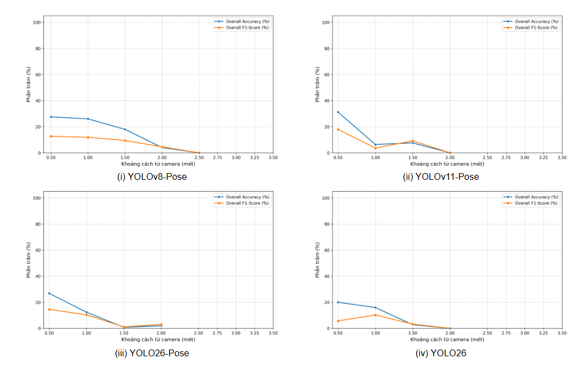
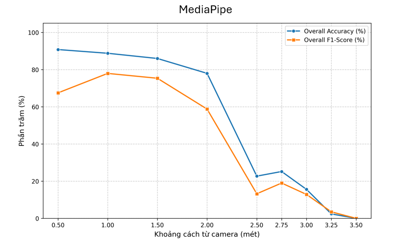
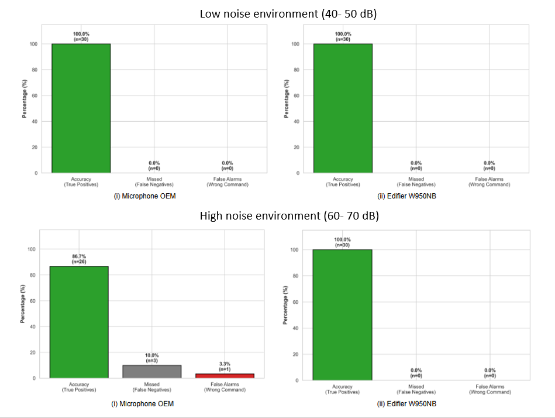

# Mobile Robot Controlled by Human Voice and Gesture (Software)

## 📖 Overview
This repository aims to develop a software stack for a multimodal Autonomous Mobile Robot (AMR) control system. Developed on the Robot Operating System 2 (ROS 2 Humble) platform, the system enables intuitive, contactless, and safe Human-Robot Interaction (HRI) in industrial environments.

## System Architecture
The software is built on a distributed, asynchronous ROS 2 architecture, divided into three main layers:
* **Perception Layer:** Independent `gesture_node` and `voice_node` asynchronously process raw camera and microphone streams.
* **Decision/Arbitration Layer:** The `command_arbiter_node` acts as the central brain, prioritizing inputs and preventing conflicting kinematic instructions.
* **Hardware Interface Layer:** Bridges the high-level ROS 2 logic with the low-level AVR microcontrollers via a serial UART node (`avr_serial_node`) to drive the AMR's actuators.

## 💻 Tech Stack & Hardware Requirements
* **Core Framework:** ROS 2 Humble
* **Languages:** Python
* **Computer Vision:** MediaPipe, OpenCV, YOLO
* **Speech Processing:** Kaldi, Vosk
* **Camera Pipeline:** Custom GStreamer capture functions optimized for concurrent processing.
* **Hardware Setup:** The system is deployed and tested on a host machine featuring an **Intel Core i5 10th Gen CPU** and an **NVIDIA GTX 1650 GPU**.

---

## 🚀 Getting Started

### Prerequisites
Before you begin, ensure your host system meets the following requirements:
* **Operating System:** Ubuntu 22.04 LTS (Optimized for ROS 2 Humble).
* **Git:** To clone the repository.
* **Docker:** To containerize and run the ROS 2 environment and AI dependencies smoothly.

*Note: If you haven't installed Docker yet, please follow the [official Docker installation guide for Ubuntu](https://docs.docker.com/engine/install/ubuntu/).*

### 1. Clone the Repository
Open your terminal and pull the project to your local machine using `git`:

```bash
git clone [https://github.com/howisgoin117/Mobile-Robot-Controlled-by-Human-Voice-and-Gesture.git](https://github.com/howisgoin117/Mobile-Robot-Controlled-by-Human-Voice-and-Gesture.git)
cd Mobile-Robot-Controlled-by-Human-Voice-and-Gesture
```

### 2. Build the Docker Environment

This project includes a `Dockerfile` to automatically configure the ROS 2 Humble workspace and install all required machine learning frameworks (MediaPipe, Kaldi/Vosk, YOLO). 

Build the Docker image by running:

```bash
docker build -t amr_multimodal_control .
```

### 3. Run the System
Once the Docker image is successfully built, you can spin up the entire multimodal control stack—including the gesture recognition node, voice processing node, and the command arbiter—using the provided shell script.
First, grant execution permissions to the script:
```bash
chmod +x start_amr.sh
```
Then, execute the script to start the container and launch the ROS 2 nodes:
```bash
./start_amr.sh
```
*Attention: Please make sure that you have already properly plugged in and granted access for both the camera and the microphone. The addresses of the device ports can be modified in `start_amr.sh`, for example, `--device=/dev/video1:/dev/video1 \` is the default address of the camera, and `  --device=/dev/ttyACM0:/dev/ttyACM0 \` is the default address of the serial port used to connect to the AVR; you should change it prior to your configuration.*

## 📊 Model Performance & Results

### Gesture Recognition (MediaPipe vs. YOLO)
An extensive evaluation was conducted comparing MediaPipe and various self-trained YOLO architectures using an [open-source hand keypoints dataset provided by YOLO](https://docs.ultralytics.com/datasets/pose/hand-keypoints#introduction)(YOLOv8-Pose, YOLOv11-Pose, YOLO26, YOLO26-Pose) across distances ranging from 0.5m to 3.5m. 




* **MediaPipe's Superiority:** MediaPipe demonstrated exceptional stability and accuracy, achieving ~90% accuracy and a 78% F1-Score at distances between 0.5m and 1.0m. It maintained a high accuracy of 78%-86% up to 2.0m.
* **YOLO Limitations:** The YOLO models struggled with the complex kinematic overlapping of hand joints, exhibiting F1-Scores consistently below 20% and failing to reliably detect gestures beyond 2.0 meters.
* **Latency:** MediaPipe proved to be highly optimized for edge computing, with an average inference latency of ~30.8 ms, which is 20-30% faster than the YOLO models (~40- 47 ms). 

### Voice Recognition (Kaldi/Vosk)
The offline Keyword Spotting (KWS) system was tested in two environments: low noise (40- 50 dB) and high industrial noise (60- 70 dB).


* **Low Noise (40- 50 dB):** The model achieved a perfect 100% command accuracy across both standard (OEM) and noise-canceling microphones.
* **High Noise (60- 70 dB):** Using a standard OEM microphone, accuracy dropped to 86.7%, with a critical 10% failure rate in recognizing the emergency "STOP" command. However, when paired with a hardware noise-canceling microphone (Edifier W950NB), the Vosk model successfully filtered out background interference and maintained a flawless 100% recognition rate.
